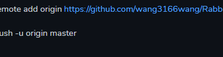

# 前期准备

## Atom工具

### 配置readme.md文件的本地编辑操作

#### https://www.jianshu.com/p/4c68bb302969

#### 1.在本地电脑上创建一个项目文件夹

#### 2.右键单击文件夹，选择Git Bash Here

#### 3.依次输入命令

git init

git add README.md

git commit -m "first commit"

git remote add origin https://github.com/wang3166wang/RabbitMQProject.git

git push -u origin master

### 用此配置可利用Atom随时提交本地文件到GitHub

