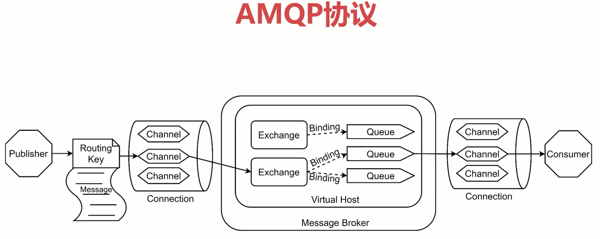
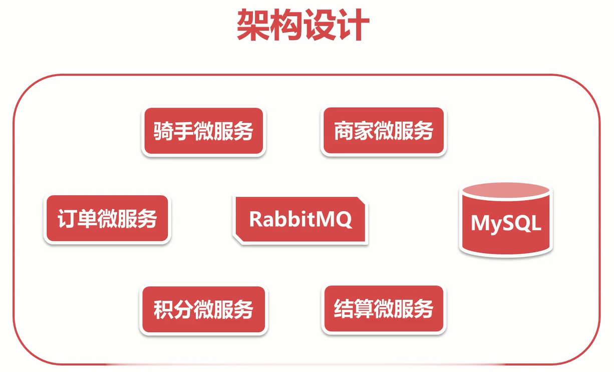
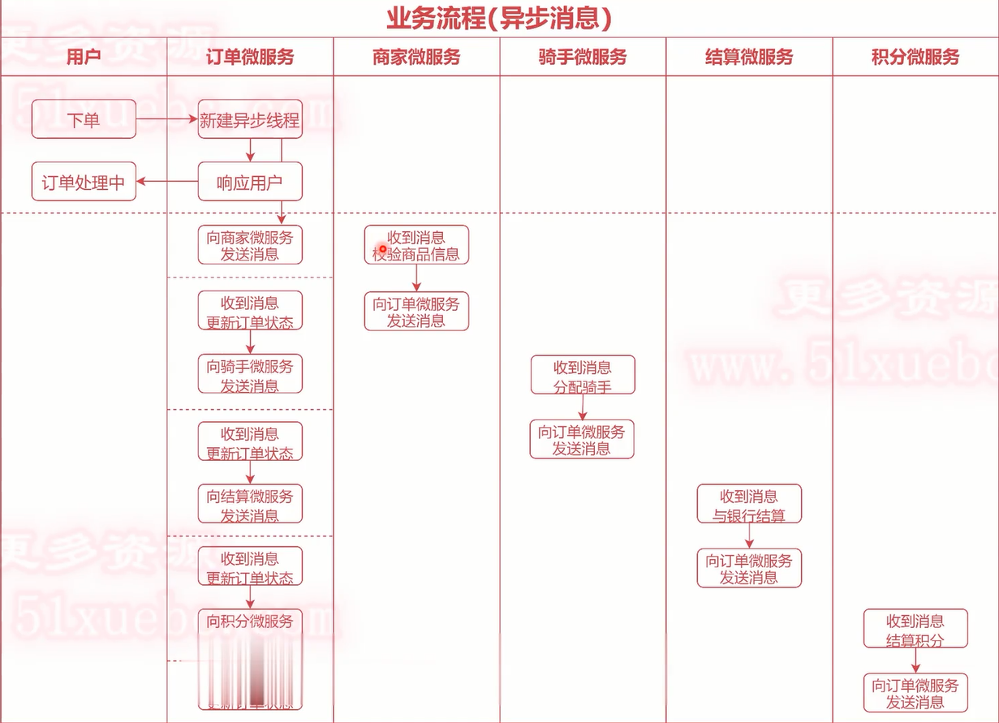
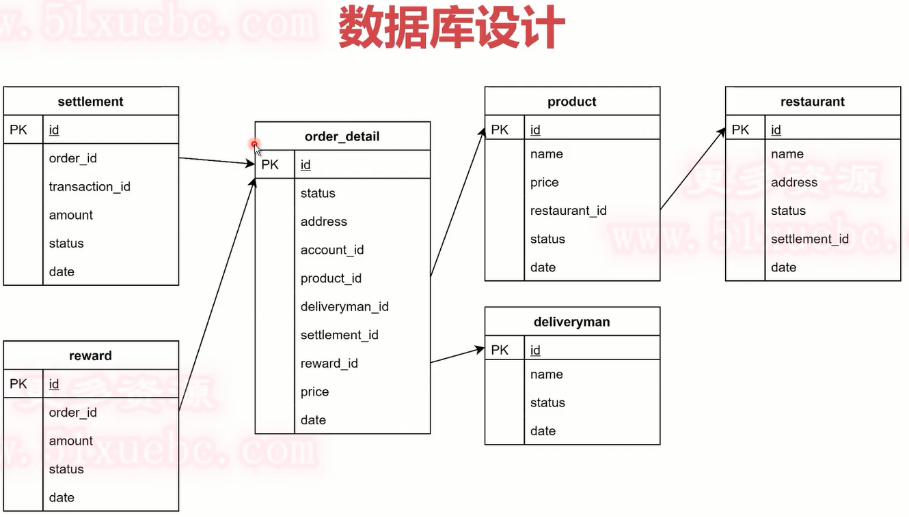
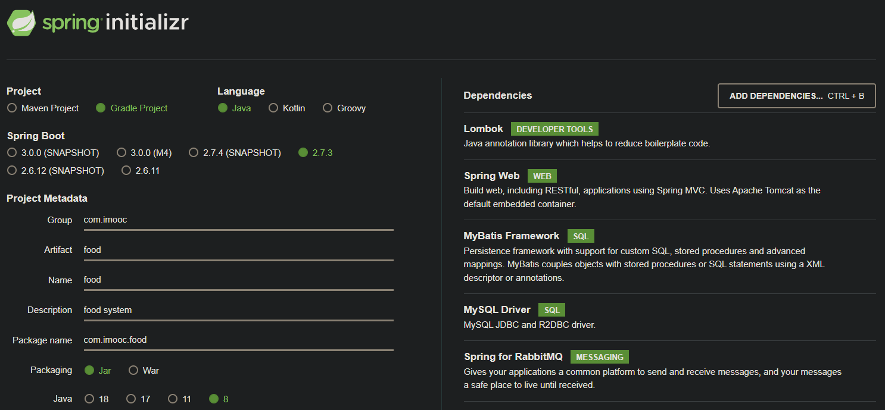

# 前期准备

## Typora 编辑器 

图片失效问题：点击【文件】→【偏好设置】→【图片插入】→点击下拉列表，选择【复制图片到./assets文件夹】→勾选【优先使用相对路径】

# 中间件

定义：提供**软件**和**软件**之间连接的**软件**，以便于软件各部件之间的沟通

作用：异步处理，系统解耦

额外：消息手机广播，流量控制

总结：

1. ActiveMQ 最“老“，老牌，但维护较慢令 
2. RabbitMQ 最“火“，适合大小公司，各种场景通杀令 
3. RocketMQ 最“猛“，功强，但考验公司运维 
4. Kafka 最“强“，支持超大量数据，但消息可靠性弱

# RabbitMQ

## erlang语言：一门为交换机软件开发诞生的编程语言

特点：

- 通用的面向并发的编程语言，适用于分布式系统

- 基于虚拟机解释运行，跨平台部署

- 进程间上下文切换效率远高于C语言

- 有着和原生Socket一样的延迟

## AMQP协议




- Broker：接收和分发消息的应用，RabbitMQ就是Message Broker
- Virtual Host：虚拟Broker，将多个单元隔离开 
- Connection：publisher／consumer和broker之间的TCP连接
- Channel：connection内部建立的逻辑连接，通常每个线程创建单独的channel
- Routing Key：路由键，用来指示消息的路由转发， 相当于快递的地址 
- Exchange：交换机，相当于快递的分拨中心 
- Queue:消息队列，消息最终被送到这里等待consumer取走 
- Binding：exchange和queue之间的虚拟连接， 用于message的分发依据 

**AMQP协议直接定义了RabbitMQ的内部结构和外部行为**

**我们使用RabbitMQ本质上是在使用AMQP协议**

**发送者不能直接将消息发送给最终队列，必须发送给交换机**  

## Exchange的作用 

- Exchange是AMQP协议和RabbitMQ的核心组件 
- Exchange的功能是根据绑定关系和路由键为消息提供路由，将消息转发至相应的队列 
- Exchange有4种类型 Direct/Topic/Fanout/Headers, 以前三种为主 

## Exchange主要有3种类型

- Direct（直接路由）:Routing Key=Binding Key，容易配置和使用 

- Fanout（广播路由）：群发绑定的所有队列，适用于消息广播 

- Topic（话题路由）：功能较为复杂，但能降级为Direct, 

### Topit Exchange 

- 根据Routing Key及通配规则，Topic Exchange将消息分发到目标Queue中 
- 全匹配 ：与Direct类似 
- Binding Key中的＃ ：匹配任意个数的word 
- Binding Key中的 * ：匹配任意1个word  

### www.tryrabbitmq.com便于理解的练习网站

## 安装erlang

- 下载并安装Erlang OTP (Open Telecom Platform) 相当于Java的jdk
- 任选其一
- https://www.erlang.org/downloads 
- https://www.erlang-solutions.com/resources/download.html 

## 安装RabbitMQ

下载并安装RabbitMQ : https://www.rabbitmq.com/

“Get Started“->“Download+Installer"->"Windows Installer“->‘'Using the official installer“

安装完成后，查看系统服务中会出现RabbitMQ 

## 网页端管理工具

### 启用前端插件 

D:\RabbitMQ Server\rabbitmq_server-3.8.3\sbin  安装目录下

#### cmd命令：

cd D:\RabbitMQ Server\rabbitmq_server-3.8.3\sbin 跳转至安装目录下

rabbitmq-plugins --help 可以看到帮助文档

rabbitmq-plugins enable rabbitmq_management  启动应用

### 浏览器打开：127.0.0.1:1 5672 

### 默认用户名：guest  默认密码：guest 

# 外卖项目

## 需求分析

- 一个外卖后端系统，用户可以在线下单外卖

- 用户下单后，可以实时查询订单进度

- 系统可以承受短时间的大量并发请求

## 架构设计

- 使用微服务系统，组件之间充分解耦
- 使用消息中间件，解耦业务逻辑
- 使用数据库，持久化业务数据

## 什么是微服务架构

- 将应用程序构建为**松耦合**、可独立部署的一组**服务**
- 服务：一个单个的、可独立部署的软件组件，实现了一些有用的功能
- 松耦合：封装服务的实现细节，通过API调用

## 架构设计



## 业务流程



## 接口需求

- 新建订单接口
- 查询订单接口
- 接口采用REST风格

## 数据库设计原则

- 每个微服务使用自己的数据库
- 不要使用共享数据库的方式进行通信
- 不要使用外键，对于数据量非常少的表慎用索引



## SpringBoot项目搭建

https://start.spring.io/



依赖下载速度慢的问题：（报错 先暂时不用）

```
	repositories {
		maven{ url 'http://maven.aliyun.com/nexus/content/groups/public/'}
		mavenCentral()
	}
```

# 细节注意

## 1.金额要使用BigDecimal类型，double和float类型都会存在精度失真

## 2.微服务通讯之间尽量使用包装类，基础类容易为null

## 3.声明的是自己监听的队列，不用管别人的队列 

## 4.对于频繁创建与销毁的线程，必须使用线程池，否则极易线程溢出，造成“线程爆炸“ 

## 5.POJO类单一职责 

- 各种POJO数据结构必须单一职责，混用会导致代码混乱 
- P0/DO :(Persistent Object/Data Object）持久对象 
- DTO :(Data丁ransfer Object）数据传输对象 
- BO:(Business Object）业务对象 
- V0: (ViewObject)显示层对象 

# 目前项目的不足

## 1.消息真的发出去了吗？

- 消息发送后，发送端不知道RabbitMQ是否真的收到消息
- 若RabbitMQ异常，消息丢失后，订单处理流程停止，业务异常
- 需要RabbitMQ发送端**确认机制**，确认消息发送

## 什么是发送端确认机制？

- 消息发送后，若中间件收到消息，会给发送端一个应答 
- 生产者接收应答，用来确认这条消息是否正常发送到中间 件 

### 解决方法：

三种确认机制：单条同步确认，多条同步确认（不推荐），异步确认（不推荐）

### 开启方法:

- 配置channel，开启确认模式 channel.confirmSelect() 
- 每发送一条消息，调用channel.waitForConfirms(）方法,等待确认 

## 2.消息真的被路由了吗？

- 消息发送后，发送端不知道消息是否被正确路由，若路由异常，消息会被丢弃 
- 消息丢弃后，订单处理流程停止，业务异常 
- 需要使用RabbitMQ**消息返回机制**，确认消息被正确路由 

### 解决方法：

### 消息返回机制原理

- 消息发送后，中间件会对消息进行路由 
- 若没有发现目标队列，中间件会通知发送方 
- Return Listener会被调用 

### 开启方法:

- 在RabbitMQ基础配置中有一个关键配置项Mandatory 
- Mandatory若为false, RabbitMQ将直接丢弃无法路由的消息 
- Mandatory若为true, RabbitMQ才会处理无法路由的消息 

```
channel.basicPublish("exchange.order.restaurant", "key.order", """"true"""" ,null, messageToSend.getBytes());
```

## 3.消费端处理的过来吗？

- 业务高峰期，可能出现发送端与接收端性能不一致，大量消息被同时推送给接收端，造成接收端服务崩溃 
- 需要使用RabbitMQ**消费端限流机制**，限制消息推送速度， 保障接收端服务稳定 

### 解决方法：

#### RabbitMQ - QoS——服务质量保证

- QoS功能保证了在一定数目的消息未被确认前，不消费新的消息
- QoS功能的前提是不使用自动确认

```
channel.basicAck(message.getEnvelope().getDeliveryTag(),""""""false""""")
```

ture:确认多条，flase:确认单条

## 4.消费端处理异常怎么办？ 

- 默认情况下，消费端接收消息时，消息会被自动确认（ACK) 
- 消费端消息处理异常时，发送端与消息中间件无法得知消息处理情况 
- 需要使用RabbitMQ**消费端确认机制**，确认消息被正确处理 

## 5队列爆满怎么办？ 

- 默认情况下，消息进入队列，会永远存在，直到被消费 
- 大量堆积的消息会给RabbitMQ产生很大的压力 
- 需要使用RabbitMQ**消息过期时间**，防止消息大量积压 

## 6.如何转移过期消息？ 

- 消息被设置了过期时间，过期后会直接被丢弃 
- 直接被丢弃的消息，无法对系统运行异常发出警报 
- 需要使用RabbitMQ**死信队列**，收集过期消息，以供分析 
