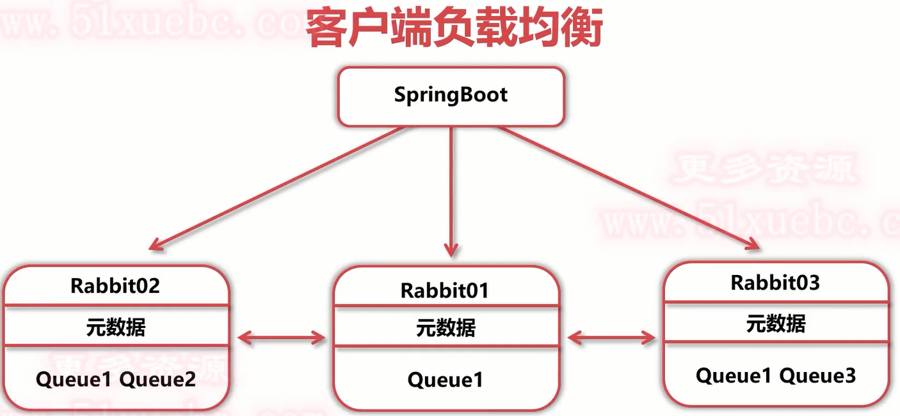

# RabbitMQ集群

## 使用集群的好处

### 1.扩展规模

- 一般的基础架构中，单机扩容（Scale-Up）很难实现
- 需要扩容时尽量使用扩展数量实现（Scale-Out）
- RabbitMQ集群可以方便地通过Scale-Out扩展规模

### 2.数据冗余 

- 对于单节点RabbitMQ，如果节点宕机，内存数据丢失 
- 对于单节点RabbitMQ，如果节点损坏，磁盘数据丢失 
- RabbitMQ集群可以通过镜像队列，将数据冗余至多个节点 

### 3.高可用

- 如果单节点RabbitMQ宕机，服务不可用
- RabbitMQ集群可以通过负载均衡，将请求转移至可用节点

## RabbitMQ集群原理 

- 多个RabbitMQ单节点，经过配置组成RabbitMQ集群 
- 集群节点之间共享元数据，不共享队列数据（默认） 
- RabbitMQ节点数据互相转发，客户端通过单一节点可以访问所有数据 


## RabbitMQ集群搭建步骤

- 设置主机名或host,使得节点之间可以通过名称访问
- 安装RabbitMQ单节点
- 复制Erlang cookie
- 启动RabbitMQ并组成集群

## 基于CENT OS 7.9系统

虚拟机中网络情况


虚拟机启动后ping 百度测试网络


设置固定IP地址

输入如下命令：

```
vi /etc/sysconfig/network-scripts/ifcfg-ens33
```


为了使地址生效，需要重新启动网络配置，输入：

```
service network restart
```

修改ip后发现ping不同百度，怀疑是DNS配置的问题，用vim打开文件 resolv.conf

```
vi /etc/resolv.conf
```

其中增加DNS配置

```css
nameserver 8.8.8.8
nameserver 114.114.114.114
```

成功ping通 百度

关闭防火墙

```
systemctl stop firewalld.service           	但是开机之后还会启动防火墙
systemctl disable firewalld.service        	禁止firewall开机启动
systemctl status firewalld					查看是否关闭
```

## [Centos8安装最新版本RabbitMQ和erlang](https://blog.csdn.net/ydl1988915/article/details/116167274)

安装完后查看是否启动成功

```
systemctl status rabbitmq-server
```


修改主机名

```
hostnamectl set-hostname mq01.localdomain
```

将主机名配置到hosts文件当中，使得三台主机名可互相访问

```
192.168.193.201
192.168.193.202
192.168.193.203
```

```
vi /etc/hosts
```

```
127.0.0.1   localhost localhost.localdomain localhost4 localhost4.localdomain4 mq01
::1         localhost localhost.localdomain localhost6 localhost6.localdomain6 mq01

192.168.193.201 mq01
192.168.193.202 mq02
192.168.193.203 mq03
```

配置完三台主机后互相ping一哈 

```
ping mq01
```

修改.erlang.cookie权限

```
chmod 777 /var/lib/rabbitmq/.erlang.cookie
```

将mq01主节点的.erlang.cookie文件传输至集群所有节点

```
scp /var/lib/rabbitmq/.erlang.cookie root@mq02:/var/lib/rabbitmq
scp /var/lib/rabbitmq/.erlang.cookie root@mq03:/var/lib/rabbitmq
```

复原01节点上.erlang.cookie权限

```
chmod 400 /var/lib/rabbitmq/.erlang.cookie
```

所有主机都打开mq服务，

然后执行

```
rabbitmqctl stop_app
```

将三个机器的mq暂停

在02和03节点上执行节点加入，并启动

```
rabbitmqctl join_cluster --ram rabbit@mq01
```

```
rabbitmqctl start_app
```

添加mq账户（guest账户默认不能访问管控台）

```
rabbitmqctl add_user test test
```

给test账户打上管理员标签

```
rabbitmqctl set_user_tags test administrator
```

附上所有权限

```
rabbitmqctl set_permissions -p / test ".*" ".*" ".*"
```

然后就可以使用test账户登录

http://192.168.193.201:15672


此时mq集群搭建完毕

目前只是解决了可扩展性


## 集群镜像队列设置方法

◆ 搭建集群
◆ 使用set *policy 命令设置镜像队列策略


rabbitmqctl set* policy [-p Vhost] Name Pattern Definition [Priority]

rabbitmqctl set_ policy Vhost 策咯名称 正则表达式 策略定义 优先级

#### Definition:策略定义

- ha-mode:指明镜像队列的模式

​				all:表示在集群中所有的节点上进行镜像

​				exactly:表示在指定个数的节点上进行镜像，节点的个数由ha-params指定

​				nodes:表示在指定的节点上进行镜像，节点名称通过ha-params指定

- ha-params: ha-mode模式需要用到的参数

- ha-svnc-mode:进行队列中消息的同步方式，有效值为**automatic**和**manual**

#### 设置镜像队列策略案例：

```
匹配所有队列，并将镜像配置到集群中的所有节点
rabbitmqctl set_policy ha-all "^" '{"ha-mode":"all"}'
```

```
名称以"two"开始的队列镜像到群集中的任意两个节点
rabbitmqctl set_policy ha-two "^two." '{"ha-mode" :"exactly" ,"ha-params":2,"ha-sync-mode":" automatic"}'
```

```
以"node"开头的队列镜像到集群中的特定节点
rabbitmqctl set_policy ha-nodes "^nodes." '{"ha-mode":"nodes","ha-params":["rabbit@nodeA","rabbit@nodeB"]}'
```

主节点上使用第一种策略

```
[root@mq01 ~]# rabbitmqctl set_policy ha-all "^" '{"ha-mode":"all"}'
Setting policy "ha-all" for pattern "^" to "{"ha-mode":"all"}" with priority "0" for vhost "/" ...
```


**以上RabbitMQ集群+镜像队列解决了 数据冗余的 问题**

## HAproxy+ Keepalived高可用集群搭建

实现高可用的方式

**1.客户端的负载均衡**



客户端负载均衡设置方法

直接在SpringBoot配置文件中设置多个地址

```
spring.rabbitmq.addresses= 127.0.0.1, 127.0.0.2, 127.0.0.3
```

客户端可以自动的负载均衡，一个挂了，数据不丢失，服务继续跑，业务不中断

**2.服务端的负载均衡**

在只能连接1个ip地址，无法连接多个时的情况下


## HAProxy简介

- HAProxy是一款提供高可用性、负载均衡以及基于TCP和HTTP应用的代理软件
- HAProxy适用于那些负载较大的web站点
- HAProxy可以支持数以万计的并发连接

HAProxy配置方法

```
建一台虚拟机进行搭建HAProxy
编辑hosts，使得haproxy能够通过主机名访问集群节点
vi /etc/hosts
192.168.193.201 mq01
192.168.193.200 mq02
192.168.193.203 mq03
```

```
yum install haproxy -y
```

 编辑haproxy配置文件

```
vi /etc/haproxy/haproxy.cfg
```

```
global
    # 日志输出配置、所有日志都记录在本机，通过 local0 进行输出
    log 127.0.0.1 local0 info
    # 最大连接数
    maxconn 4096
    # 守护模式
    daemon
# 默认配置
defaults
    # 应用全局的日志配置
    log global
    # 使用4层代理模式，7层代理模式则为"http"
    mode tcp
    # 日志类别
    option tcplog
    # 不记录健康检查的日志信息
    option dontlognull
    # 3次失败则认为服务不可用
    retries 3
    # 每个进程可用的最大连接数
    maxconn 2000
    # 连接超时
    timeout connect 5s
    # 客户端超时
    timeout client 120s
    # 服务端超时
    timeout server 120s
# 绑定配置
listen rabbitmq_cluster
    # 绑定端口，需要不被占用的端口
    bind :5671
    # 配置TCP模式
    mode tcp
    # 采用加权轮询的机制进行负载均衡
    balance roundrobin
    # RabbitMQ 集群节点配置
    server master master:5672 check inter 5000 rise 2 fall 3 weight 1
    server salve1 salve1:5672 check inter 5000 rise 2 fall 3 weight 1
    server salve2 salve2:5672 check inter 5000 rise 2 fall 3 weight 1
    server salve3 salve3:5672 check inter 5000 rise 2 fall 3 weight 1
# 配置监控页面
listen monitor
    bind *:8100
    mode http
    option httplog
    stats enable
    stats uri /rabbitmq
    stats refresh 5s
```

设置seLinux

```
sudo setsebool -P haproxy_connect_any=1
```

关闭防火墙

```
systemctl stop firewalld.service
systemctl disable firewalld.service
```

启动haproxy

```
systemctl start haproxy
```

进入web监控界面

http://192.168.193.201:8100/rabbitmq


问题：HaProxy挂了怎么办?

- 再用一层负载均衡，不能解决问题，因为最后一层机器永远有风险
- 使用Virtual IP (VIP， 虚拟IP) 解决问题

## Keepalived简介

- 高性能的服务器高可用或热备解决方案
- 主要来防止服务器单点故障的发生问题
- 以VRRP协议为实现基础，用VRRP协议来实现高可用性


keepalived配置(两个节点都需要)

- 1.安装keepalived

```
yum install keepalived -y
```

- 2.编辑keepalived配置文件

```
vi /etc/keepalived/keepalived.conf
```

主机配置文件：(主节点)

```
! Configuration File for keepalived
global_defs {
    router_id master
    vrrp_skip_check_adv_addr
    vrrp_strict
    vrrp_garp_interval 0
    vrrp_gna_interval 0
}
vrrp_script chk_haproxy {
    script "/etc/keepalived/haproxy_check.sh" ##执行脚本位置
    interval 2 ##检测时间间隔
    weight -20 ##如果条件成立则权重减20
}
vrrp_instance VI_1 {
    # 配置需要绑定的VIP和本机的IP
    state MASTER
    interface ens33
    virtual_router_id 28
    # 本机IP
    mcast_src_ip 192.168.193.201
    priority 100
    advert_int 1
    # 通信之间设置的用户名和密码
    authentication {
        auth_type PASS
        auth_pass 123456
    }
    # 虚拟IP
    virtual_ipaddress {
        192.168.193.238
    }
    # 健康检查
    track_script {
        chk_haproxy
    }
}
```

热备机配置文件：(从节点)

```
global_defs {
    router_id salve1
    vrrp_skip_check_adv_addr
    vrrp_strict
    vrrp_garp_interval 0
    vrrp_gna_interval 0
}
vrrp_script chk_haproxy {
    script "/etc/keepalived/haproxy_check.sh" ##执行脚本位置
    interval 2 ##检测时间间隔
    weight -20 ##如果条件成立则权重减20
}
vrrp_instance VI_1 {
    state BACKUP
    interface ens33
    virtual_router_id 28
    mcast_src_ip 192.168.193.201
    priority 50
    advert_int 1
    authentication {
        auth_type PASS
        auth_pass 123456
    }
    virtual_ipaddress {
        192.168.193.238
    }
    track_script {
        chk_haproxy
    }
}
```

- 3.健康检测脚本

```
vi /etc/keepalived/haproxy_check.sh
```

```
#!/bin/bash
COUNT=`ps -C haproxy --no-header |wc -l`
if [ $COUNT -eq 0 ];then
    systemctl start haproxy
    sleep 2
    if [ `ps -C haproxy --no-header |wc -l` -eq 0 ];then
        systemctl stop keepalived
    fi
fi
```

修改健康检测脚本执行权限

```
chmod +x /etc/keepalived/haproxy_check.sh
```

启动keepalived

```
systemctl start keepalived
```

启动后发现主节点ip中多了一个虚拟ip，而从节点没有
主节点ip：


从节点ip：


做故障转移实验时，关闭keepalived即可

```
systemctl stop keepalived
```

关闭主节后发现从节点ip中多了一个虚拟ip，而主节点虚拟ip消失了
主节点ip：


从节点ip：


总结

- RabbitMQ集群 + 镜像队列 + HAproxy + Keepalived可以同时解决RabbitMQ的可扩展、数据冗余、高可用.
- 在使用客户端负载均衡时，可以省去HAproxy+ Keepalived

## RabbitMQ集群间通信

问题：如果两个集群间处于异地，需要通讯会有以下问题

- 由于异地网络延时，异地RabbitMQ和业务应用之间很难建立网络连接
- 由于异地网络延时，异地RabbitMQ之间很难建立集群
- 此时如果异地RabbitMQ之间需要共享消息，需要使用集群间通信机制

**RabbitMQ集群间通信方法**

Federation(联邦)简介：

- 通过AMQP协议，使用一个内部交换机，让原本发送到一个集群的消息转发至另一个集群
- 消息可以从交换机转发至交换机，也可以由队列转发至队列
- 消息可以单向转发，也可以双向转发

Federation设置方法

启用Federation插件

```
rabbitmq-plugins enable rabbitmq_federation_management
```

使用管控台具体配置Federation

具体使用的时候再查文档

◆Shovel (铲子)

Federation简介：

- Shovel可以持续地从一 个broker拉取消息转发至另一个broker
- Shovel的使用较为灵活，可以配置从队列至交换机从队列至队列，从交换机至交换机

Shovel设置方法
启用插件

```
rabbitmq-plugins enable rabbitmq *shovel* management
```

使用管控台具体配置Shovel

具体使用的时候再查文档

**总结**

- Federation和Shovel都是在broker之间转发/共享消息的方法
- Federation只能在交换机之间或者队列之间转发消息
- Shovel更加灵活，可以在交换机和队列之间转发消息

## 实际开发经验

- 体系架构升级的根本原因是需求
- 不要盲目升级更高级的架构，更高级的架构意味着对运维有更高的要求
- 多思考架构拓扑，形成更好的架构思维

## 小结

- 为了追求规模的扩展性，搭建RabbitMQ集群
- 为了追求数据的冗余，使用RabbitMQ集群镜像队列
- 为了RabbitMQ服务高可用，使用了服务端的负载均衡技术
- 为了跨地域传送消息，学习了跨broker通信技术