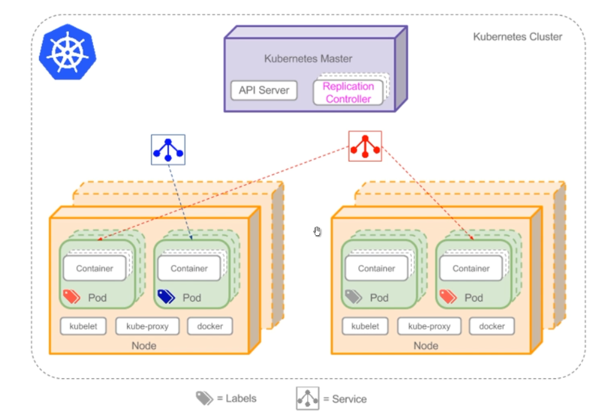

# 优化RabbitMQ集群

## 为什么需要优化

### 什么是真正的高可用

- 在传统以物理机/虚拟机为基础的架构中，服务宕机往往需要人工处理
- 随着容器技术的发展，容器编排框架可以很好的解决高可用问题
- K8S已经成为容器编排的事实标准，能够承载RabbitMQ集群

### 网络分区故障

- 在实际生产中，网络分区是非常常见的故障原因
- 网络分区的排查和处理难度较大，需要专门门研究

### RabbitMQ状态监控

- 在生产环境中，需要实时关注RabbitMQ集群状态
- RabbitMQ状态包括流量、内存占用、CPU占用等

## 什么是docker

- 将应用的Libs（函数库）、Deps（依赖）、配置与应用一起打包
- 将每个应用放到一个隔离**容器**去运行，避免互相干扰

## 虚拟机上安装docker

相关依赖包：

```
sudo yum install yum-utils device-mapper-persistent-data lvm2 -y
```

引入docker相关路径：

```
sudo yum-config-manager --add-repo https://download.docker.com/linux/centos/docker-ce.repo
```

安装docker

```
sudo yum install docker-ce
```

启动docker

```
systemctl enable docker
systemctl start docker
```

查看docker是否启动，查看版本命令

```
docker -v 
```

如何部署一个镜像，docker官方提供了一个hello-world项目，直接运行即可

```
docker run hello-world
```


Docker运行RabbitMQ(下载必备依赖，安装，运行，一条命令搞定)

```
docker run -d --rm --name rabbitmq -p 5672:5672 -p 15672:15672 rabbitmq:3-management
```

查看docker启动的服务

```
docker ps
```


## 使用DockerCompose部署高可用集群

### 什么是Docker Compose

- Compose是用于定义和运行多容器Docker应用程序的工具
- 通过Compose,可以使用YAML文件来配置应用程序需要的所有服务
- 使用一个命令，就可以从YAML文件配置中创建并启动所有服务

### 编写DockerCompose配置文件docker-compose.yml

```
version: "2.0"
services:
    rabbit1:
        image: rabbitmq:3-management
        hostname: rabbit1
        ports:
            - 5672:5672 #集群内部访问的端口
            - 15672:15672 #外部访问的端口
        environment:
            - RABBITMQ_DEFAULT_USER=guest #用户名
            - RABBITMQ_DEFAULT_PASS=guest #密码
            - RABBITMQ_ERLANG_COOKIE='rabbitmq'
    rabbit2:
        image: rabbitmq:3-management
        hostname: rabbit2
        ports:
            - 5673:5672 #集群内部访问的端口
        environment:
            - RABBITMQ_ERLANG_COOKIE='rabbitmq'
        links:
            - rabbit1
    rabbit3:
        image: rabbitmq:3-management
        hostname: rabbit3
        ports:
            - 5674:5672 #集群内部访问的端口
        environment:
            - RABBITMQ_ERLANG_COOKIE='rabbitmq'
        links:
            - rabbit1
            - rabbit2
```

### 安装DockerCompose

安装相关依赖(python包管理器)

```
yum install epel-release
yum install dnf
dnf install python3-pip
python3 -m pip install -U pip(下面命令报错时使用这个，再使用这个)
pip3 install docker-compose
```

安装完成后查看版本

```
docker-compose version
```


配置docker-compose.yml(位置好像不重要)

```
vi docker-compose.yml
```

启动docker-compose，按照脚本启动集群

```
docker-compose up -d
```

如果启动不成功是因为端口被占用，如：

```
[root@mq01 ~]# docker-compose up -d
/usr/local/lib/python3.6/site-packages/paramiko/transport.py:33: CryptographyDeprecationWarning: Python 3.6 is no longer supported by the Python core team. Therefore, support for it is deprecated in cryptography and will be removed in a future release.
  from cryptography.hazmat.backends import default_backend
Starting root_rabbit1_1 ... 
Starting root_rabbit1_1 ... error

ERROR: for root_rabbit1_1  Cannot start service rabbit1: driver failed programming external connectivity on endpoint root_rabbit1_1 (282f3b2ce8ce43fdd49a0815da8e079cc21a8a9140150a4b89d3b664c9369fe3): Bind for 0.0.0.0:15672 failed: port is already allocated

ERROR: for rabbit1  Cannot start service rabbit1: driver failed programming external connectivity on endpoint root_rabbit1_1 (282f3b2ce8ce43fdd49a0815da8e079cc21a8a9140150a4b89d3b664c9369fe3): Bind for 0.0.0.0:15672 failed: port is already allocated
ERROR: Encountered errors while bringing up the project.
```

先使用docker ps命令查看是否有其他服务启动，关闭即可

```
docker stop rabbitmq
```

启动成功


再次查看启动的服务


所有salve关联加入集群   

1.进入第二个容器

```
docker exec -it root_rabbit2_1 bash
```

2.停掉服务

```
rabbitmqctl stop_app
```

3.配置rabbit2节点，加入集群

```
rabbitmqctl join_cluster rabbit@rabbit1
```

4.启动rabbitmq

```
rabbitmqctl start_app
```

5.退出

```
exit
```

第三个容器和第二个容器操作相同

## 使用Kubernetes部署高可用集群



docker-compose简单易用但只能在一台服务器上调度容器

K8S可以在做到跨服务器上调度容器

### Kubernetes相关概念：

- Pod: K8S中的最小业务单元，内含一个或多个容器
- StatefulSet: 定义一组有状态Pod，K8S将自动维护
- Deployment: 定义一组无状态Pod， K8S将自动维护
- Service: 一组Pod的抽象访问方式，相当于负载均衡器

### Kubernetes搭建RabbitMQ集群的脚本

```
kind: Service
# 相当于负载均衡层
apiVersion: v1
metadata:
    # 元数据
    namespace: test-rabbitmq
    name: rabbitmq
    labels:
        app: rabbitmq
        type: LoadBalancer
    spec:
        type: NodePort
        ports:
          - name: http
            protocol: TCP
            port: 15672
            targetPort: 15672
            nodePort: 30672
          - name: amqp
            protocol: TCP
            port: 5672
            targetPort: 5672
            nodePort: 30672
        selector:
            app: rabbitmq
---
apiVersion: v1
# 用于注入配置文件
kind: ConfigMap
metadata:
    name: rabbitmq-config
    namespace: test-rabbitmq
data:
    enabled_plugins: |
        [rabbitmq_management,rabbitmq_peer_discovery_k8s].
    rabbitmq.conf: |
        cluster_formation.peer_discovery_backend = rabbit_peer_discovery_k8s
        cluster_formation.k8s.host = kubernetes.default.svc.cluster.local
        cluster_formation.k8s.address_type = ip
        cluster_formation.node_cleanup.interval = 30
        cluster_formation.node_cleanup.only_log_warning = true
        cluster_partition_handling = autoheal
        loopback_users.guest = false
---
apiVersion: apps/v1beta1
kind: StatefulSet
metadata:
    name: rabbitmq
    namespace: test-rabbitmq
spec:
    serviceName: rabbitmq
    replicas: 3
    template:
        metadata:
            labels:
                app: rabbitmq
            spec:
                serviceAccountName: rabbitmq
                terminationGracePeriodSeconds: 10
                containers:
                  - name: rabbitmq
                    image: rabbitmq:3-management
                volumeMounts:
                  - name: config-volume
                    mountPath: /etc/rabbitmq
                ports:
                    - name: http
                      protocol: TCP
                      containerPort: 15672
                    - name: amqp
                      protocol: TCP
                      containerPort: 5672
                # 检查健康状态的探针
                livenessProbe:
                    exec:
                        command: ["rabbitmqctl", "status"]
                    initialDelaySeconds: 60
                    periodSeconds: 60
                    timeoutSeconds: 10
                readinessProbe:
                    exec:
                        command: ["rabbitmqctl", "status"]
                    initialDelaySeconds: 20
                    periodSeconds: 60
                    timeoutSeconds: 10
                imagePullPolicy: Always
                env:
                  - name: MY_POD_IP
                    valueFrom:
                        fieldRef:
                            fieldPath: status.podIP
                  - name: RABBITMQ_USE_LONGNAME
                    value: "true"
                  - name: RABBITMQ_NODENAME
                    value: "rabbit@$(MY_POD_IP)"
                  - name: K8S_SERVICE_NAME
                    value: "rabbitmq"
                  - name: RABBITMQ_ERLANG_COOKIE
                    value: "rabbit"
                volumes:
                  - name: config-volume
                    configMap:
                        name: rabbitmq-config
                        items:
                          - key: rabbitmq.conf
                            path: rabbitmq.conf
                          - key: enabled_plugins
                            path: enabled_plugins
```

## 网络分区故障

### 什么是网络分区

网络分区指的是集群分裂为了两个网络“孤岛


### RabbitMQ集群网络模型

- RabbitMQ集群采用单向环状网络模型


- 当网络部分异常时，环状网络异常，相关业务堵塞


### RabbitMQ集群网络分区的意义

此时可以人为造成网络分区，保存部分集群正常运行


### 集群网络分区处理方法

#### 手动处理

- 步骤1:挂起客户端进程

可以减少不必要的消息丢失，如果进程数过多，可跳过

- 步骤2: 删除镜像队列的配置

如果没有删除镜像队列配置，恢复过程中可能会出现队列漂移
相关命令查看这：https://www.wangt.cc/2020/12/rabbitmq常用命令/

- 步骤3:挑选信任分区.

挑选的指标有:是否有disk节点 > 分区节点数 > 分区队列数 > 分区客户端连接数

- 步骤4:关闭非信任区的节点

采用rabbitmqctl stop_ app命令，只关闭RabbitMQ应用，不会关闭ErLang虚拟机.

- 步骤5:启动非信任区的节点

采用rabbitmqctl start_ app命令，启动过程中伴随着网络的修复

- 步骤6:检查网络分区是否恢复

若已经恢复跳转至步骤8

若还存在网络分区进行步骤7

- 步骤7:重启信任分区中的节点

使用步骤4与5的命令

- 步骤8:添加镜像队列的配置

```
rabbitmqctl set_policy ha-all "^" '{"ha-mode":"all"}'
```

- 步骤9:恢复生产者和消费者的进程

若步骤1并未挂起客户端进程，也应该检查客户端连接,必要时重启客户端

#### 自动处理

RabbitMQ中有3种网络分区自动处理模式:

pause-minority/pause-if-all-down/autoheal

pause-minority：

发生网络分区时，节点自动检测自己是否处于少数派，若是则关闭自己

若出现了节点数相同的两个分区，可能会导致两个分区全部关闭

pause-if-all-down:

每个节点预先配置一个节点列表，当失去和列表中所有节点的通信时，关闭自己.

此方法考验配置的合理性，配置不合理可能会导致集群节点全部宕机

autoheal:

发生网络分区时，每个节点使用特定算法自动决定一个“获胜分区",然后重启不在分区的其他节点

当节点中有关闭状态时，autoheal不会起作用

默认是ignore模式:发生网络分区时，不做任何动作，需要人工介入。

如要开启，配置rabbitmq.config中的cluster *parititon* handling参数


### 总结

- 集群网络分区有两种处理方式:手动和自动
- 手动处理方 式比较考验运维操作水平，但比较常用
- 慎用自动处理方式，因为如果配置不合理，会导致更大的问题

## RabbitMQ状态监控方式

- 通过Java API判断节点是否健康

使用Java应用创建connection与channel

```
Connection connection = connect ionFac tory. newConnection() ;
Channel channel = connect ion. createChannel() ;
```

若能创建成功，则节点健康，若创建失败(抛异常)则节点

挂机或与节点的网络连接异常

- 通过HTTP Rest API监控集群状态(15672端口)

使用api/nodes/接口获得节点信息

使用api/exchanges/{vhost}/{name}/接口获得exchange状态信息

使用api/queues/{vhost}/{name}/接口获得queue状态信息

- 通过监控中间件监控RabbitMQ

常见的监控中间件有Zabbix、Prometheus等

Zabbix、Prometheus的底层原理 是调用HTTP Rest API,再讲数据处理、存储、展示

## 目前的项目不足之处分析

1.发送消息时无法自动重试

- 消息若发送失败，没有重试处理机制
- 若RabbitMQ集群短暂宕机，消息丢失，业务异常

2.无法得知接收方处理情况

- 发送方无法得知消息是否被处理
- 若消息丢失，业务异常

3.无法自动处理并标记死信

- 死信消息依赖人工处理，需要自动处理并标记
- 消息状态的标记依赖数据库或缓存，对消息状态进行存储

