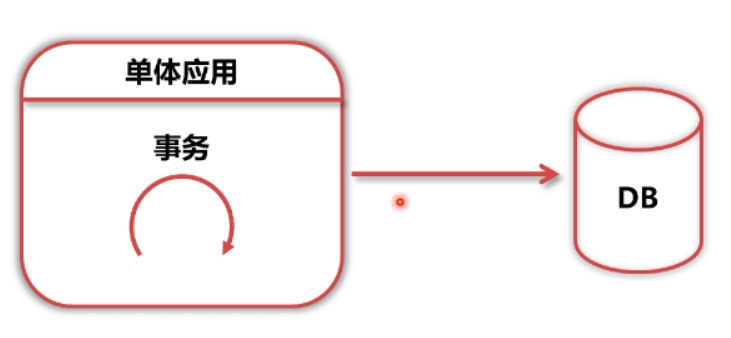
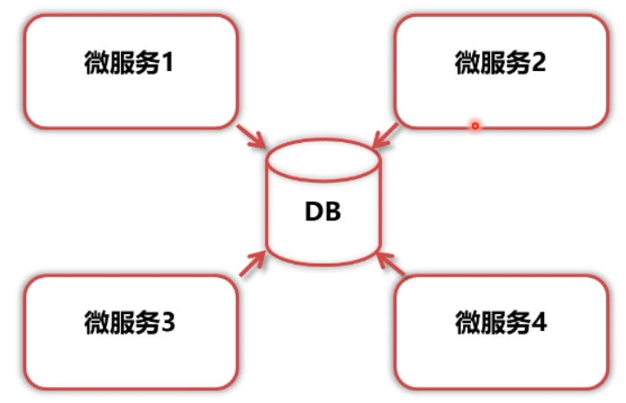
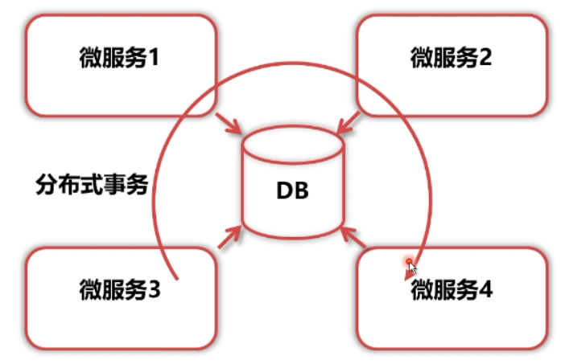
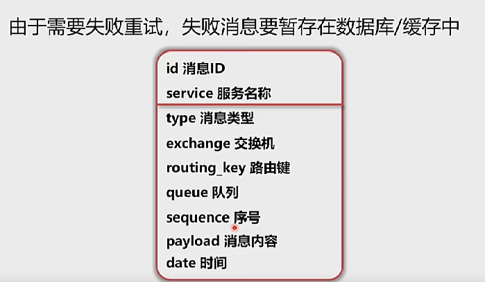
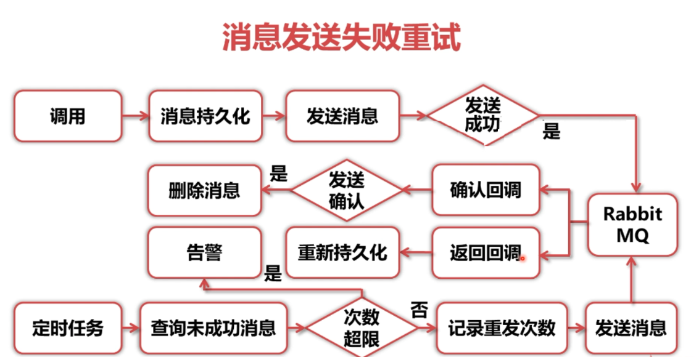
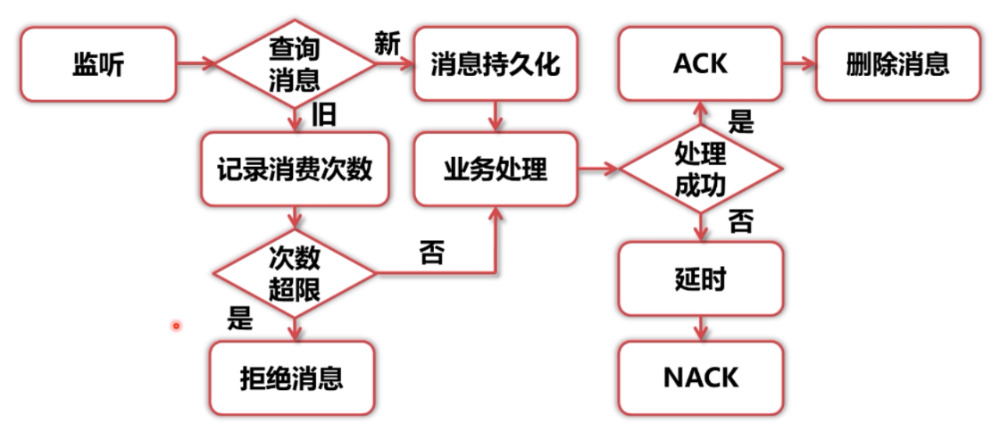
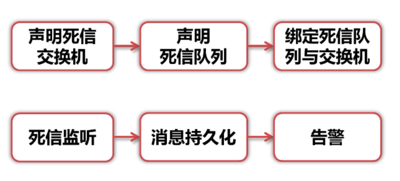

# 分布式事务框架分析

## 事务为什么要分布式

1.什么是事务

- 事务指的是一 系列业务操作，只能同时成功或同时失败
- 传统事务有4个主要特性:原子性、一致性、隔离性、持久性

2.微服务化带来的挑战

- 在传统单体应用中，事务在本地即可完成
- 随着后端架构的微服务化，事务无法在本地完成
- 所以需要将事务“分布式化”

3.传统单体应用

在传统单体应用中，事务在本地即可完成

4.微服务应用

随着后端架构的微服务化，事务无法在本地完成

所以需要将事务"分布式化"

## 事务的前提理论

### 1.分布式框架理论 ACID

事务正确执行的四个基本要素

- 原子性(Atomicity)
- 一致性(Consistency)
- 隔离性(Isolation)
- 持久性(Durability)

### 2.分布式框架理论 CAP

一致性、可用性、分区容忍性不可能三者兼顾

- 一致性(Consistency)
- 可用性(Availability)
- 分区容忍性 (Partition tolerance)

### 3.分布式框架理论 BASE

由于CAP无法同时满足，基于工程实际，提出了BASE理论

- Basically Available (基本可用)
- Soft state (软状态)
- Eventually consistent (最终一致性)

## 分布式事务的取舍

- ACID往往针对传统本地事务，分布式事务无法满足原子性和隔离性，需要舍弃传统ACID理论
- 基于BASE理论，业务状态不需要在微服务系统内强一致
- 基于BASE理论,订单状态要做到最终一致性即可
- 为了做到最终一致性, 要保证消息不丢失，发送处理的流程要有重试机制，重试多次失败后要有告警

## 分布式事务框架设计

根据上述分析，分布式事务框架应该包含以下部分

- 发送失败重试
- 消费失败重试
- 死信告警

### 数据表设计

## 分布式事务框架搭建

要用到的相关技术：

- 声明ConnectionFactory、RabbitAdmin、RabbitListenerContainerFactory、RabbitTemplate
- 声明枚举、PO、 开发dao层
- 声明定时任务

## 分布式事务相关说明

1.消息发送失败重试

- 发送消息前消息持久化
- 发送成功时删除消息
- 定时巡检未发送成功消息、重试发送

2.消息消费失败重试

- 收到消息时先进行持久化
- 消息处理成功，消费端确认(ACK)，删除消息
- 消息处理失败，延时，不确认消息(NACK)，记录次数
- 再次处理消息

3.死信消息告警

- 声明死信队列、交换机、绑定
- 普通队列加入死信设置
- 监听到死信，持久化、告警

## 小结

1. 消息发送失败重试，消息消费失败重试，死信消息告警只是有效的保证rabbitMQ消息的事务一致性，有效的解决了消息失败的结果。
2. 在实际项目中可以把开发的分布式事务框架包moddymq新建另外一个项目，并打成jar包，统一使用规范供多微服务模块使用
3. 本moddymq中并无注明给死信队列queue.dlx发送消息的场景，实际开发中可以定时将状态为DEAD的消息发送至死信队列进行死信告警。告警方法方法已给出，但具体告警逻辑可以根据实际场景需要进行完善。

